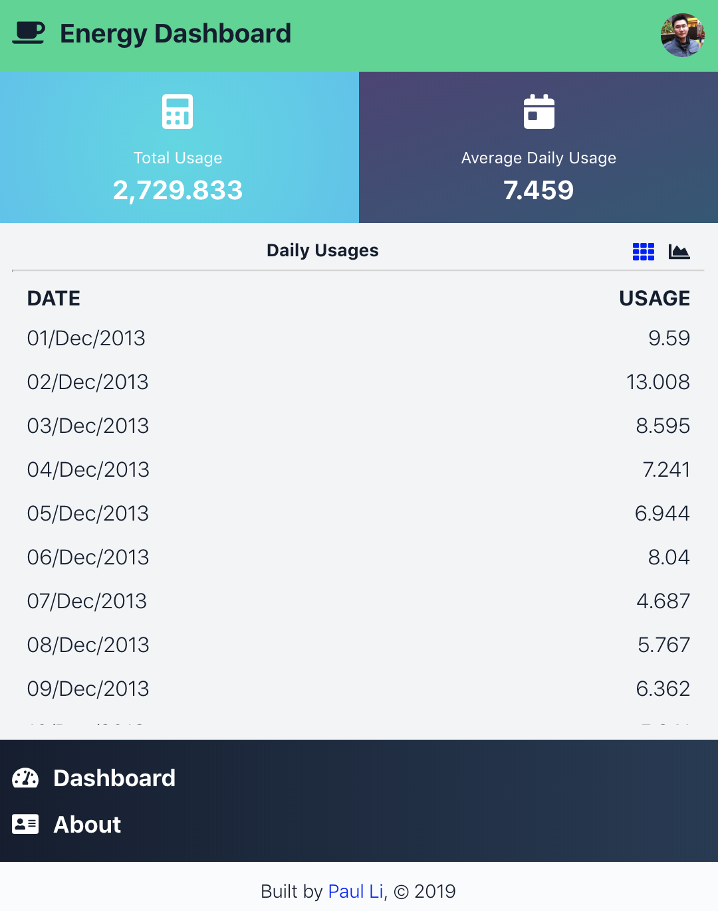
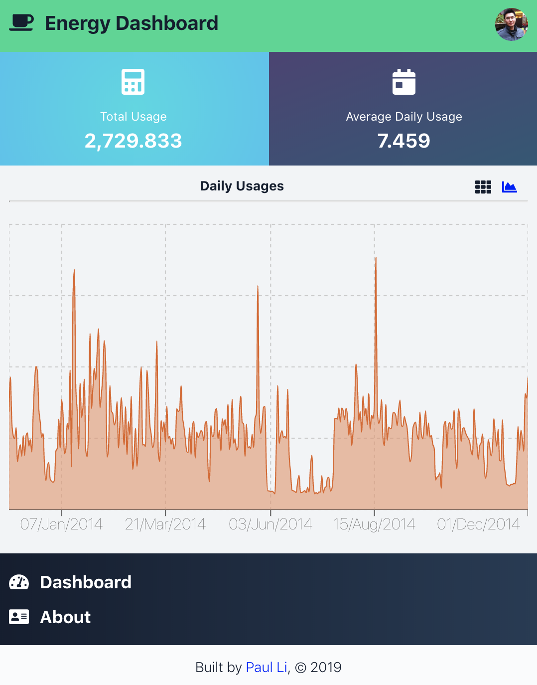
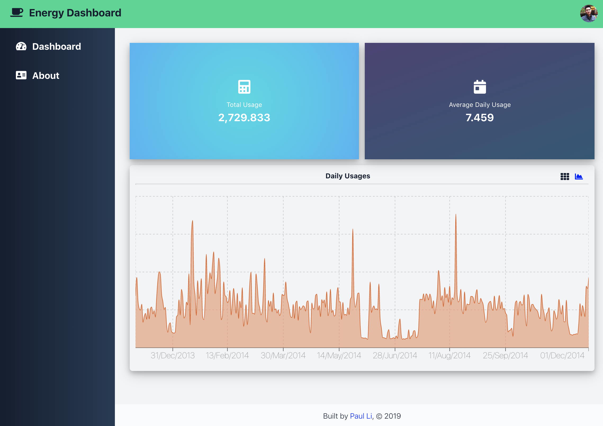

Energy Dashboard - https://energy-dashboard.netlify.com

[](https://app.netlify.com/sites/energy-dashboard/deploys)

## Get Started

```sh
yarn
yarn test
yarn start

# Navigate to http://localhost:3000/
```

## Screenshots

<div>
  <a href="screenshots/screenshot1.png">
    
  </a>
  &nbsp;
  <a href="screenshots/screenshot2.png">
    
  </a>
  &nbsp;
  <a href="screenshots/screenshot3.png">
    
  </a>
</div>

## Keynotes

1. This is a monorepo managed by [lerna](https://github.com/lerna/lerna) and [yarn workspaces](https://yarnpkg.com/lang/en/docs/workspaces/).
2. Tested with `node 8.10` which supports native `async/await` and many ES6 features such as `const`.
3. Added netlify
